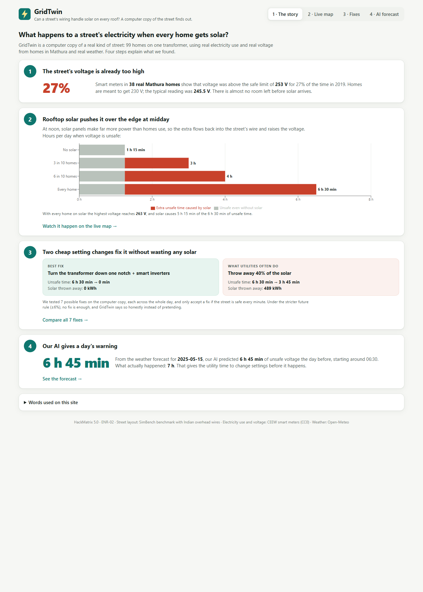
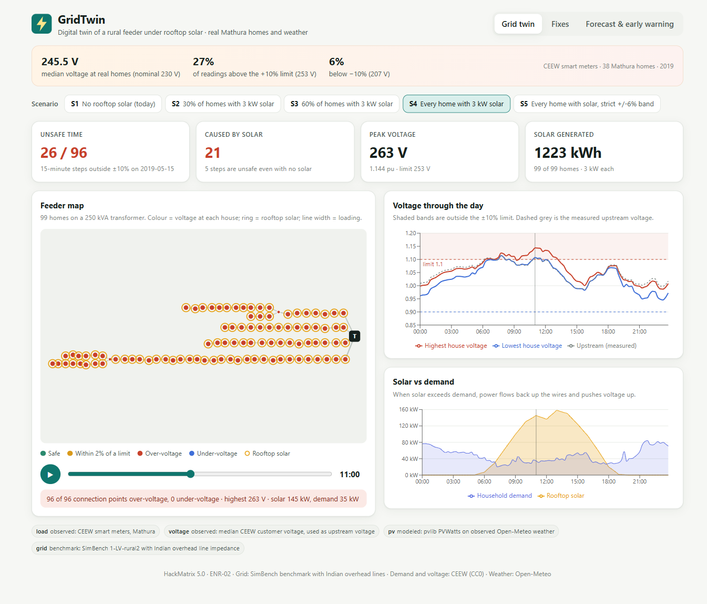
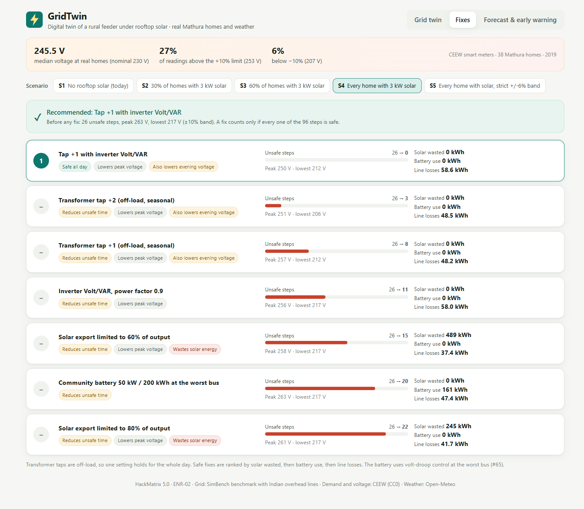
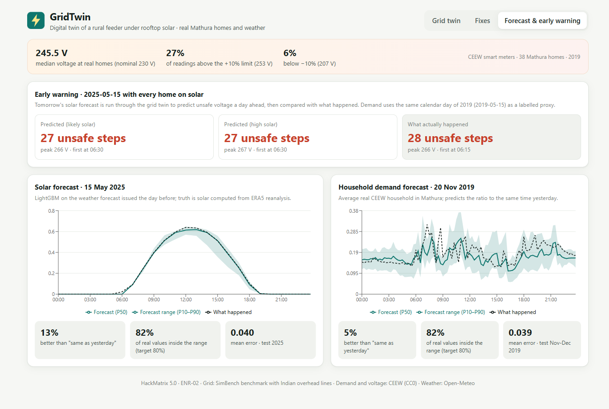
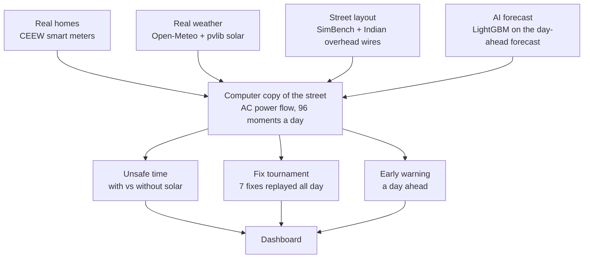

# GridTwin

[](https://github.com/abhay-hanchate/GridTwin/actions/workflows/ci.yml)
[](https://github.com/abhay-hanchate/GridTwin/actions/workflows/features.yml)

**HackMatrix 5.0 · Energy track · ENR-02 — Renewable Distribution Grid Digital Twin**

GridTwin is a computer copy of a rural Indian street's electricity network. It shows **when rooftop solar will make voltage unsafe, how much of that is solar's fault, and the cheapest fix that keeps the street safe all day** — and our AI warns a day in advance. It runs on real household electricity use and real measured voltage from smart meters in Mathura, real weather, and a physics-based power-flow engine.

## The problem, in real data

India is putting rooftop solar on 1 crore homes (PM Surya Ghar). At midday, solar makes more power than homes use, so the surplus flows back up the street's wire and **raises** the voltage. Too much voltage damages appliances and makes solar inverters switch off.

Smart meters in 38 Mathura homes (CEEW, 2019) show the street is already close to the edge:

| Measured at real homes | Value |
| --- | --- |
| Typical voltage (should be 230 V) | **245.5 V** |
| Time above the 253 V safe limit (+10%) | **27.2%** |
| Time below 207 V (−10%) | 6.1% |

## What GridTwin shows

On a real day (15 May 2019) for a 99-home street with one 250 kVA transformer, safe band 207–253 V:

| Homes with 3 kW rooftop solar | Unsafe time per day | Caused by solar | Highest voltage |
| --- | --- | --- | --- |
| None | 1 h 15 min | 0 | 256 V |
| 3 in 10 | 3 h | 1 h 45 min | 256 V |
| 6 in 10 | 4 h | 2 h 45 min | 259 V |
| Every home | **6 h 30 min** | **5 h 15 min** | **263 V** |
| Every home, stricter ±6% rule | 11 h 45 min | 1 h | 263 V |

**Seven fixes tested, each replayed over the whole day:**

| Fix | Unsafe time left | Solar thrown away |
| --- | --- | --- |
| **Transformer one notch lower + smart inverters** (recommended) | **0 min** | **0 kWh** |
| Transformer two notches lower | 45 min (evenings drop to 206 V) | 0 kWh |
| Transformer one notch lower | 2 h | 0 kWh |
| Smart inverters only | 2 h 45 min | 0 kWh |
| Throw away 40% of solar (common today) | 3 h 45 min | 489 kWh |
| Neighbourhood battery 50 kW | 5 h | 0 kWh |
| Throw away 20% of solar | 5 h 30 min | 245 kWh |

Under the stricter ±6% rule **no fix is enough**, and GridTwin says so instead of pretending.

**AI early warning:** for 15 May 2025, the forecast predicted **6 h 45 min** of unsafe voltage a day ahead; **7 h** happened.

## The dashboard

Five dashboard screens that follow the story.

**1 · The story** — the whole project in four plain steps: the voltage is already too high, solar pushes it over at midday, two cheap settings fix it, and the AI warns a day early.



**2 · Live map** — the street coloured by voltage at every point; press play to watch a day. Switch between no solar, 3 in 10 homes, 6 in 10 homes, every home, and the strict rule.



**3 · Fixes** — the fix simulator plays two maps side by side, without and with the chosen fix, on one clock; a live line says what the fix is doing (for example, inverters absorbing 70 kvar), and impact cards show the before and after. All seven fixes are ranked below.



**4 · AI forecast** — how the warning is made, the AI's predicted street next to an ERA5/PVWatts reference simulation, and the separate solar and demand forecast evaluations.



**5 · Hosting capacity** — how much rooftop solar the feeder can host at 10% adoption steps, with and without the recommended fix. The estimate compares against the existing no-solar voltage baseline and requires the corrected case to be safe all day.

## How it works



| Component | What it does | Why it exists |
| --- | --- | --- |
| `engine/profiles.py` | Turns 3-minute meter readings into 15-minute household use and street voltage; models solar with pvlib | The twin must run on real Indian data |
| `engine/grid.py` | Builds the 99-home street with Indian overhead-wire values and working transformer taps | A public benchmark layout, adapted to Indian conditions |
| `engine/powerflow.py` | Replays a day in 96 steps, solving the physics at each and flagging unsafe voltage | The core of the twin |
| `engine/scenarios.py` | Five solar scenarios, each also run without solar | Shows how much unsafe time solar itself causes |
| `engine/actions.py` | The seven fixes as small functions applied at every step | New fixes plug in without new simulation code |
| `engine/ranking.py` | Keeps only fixes safe all day, ranks them by solar wasted, battery use and losses, or reports no safe action | Honest, verifiable recommendations |
| `engine/hosting_capacity.py` | Sweeps solar adoption in 10% steps and checks hosting capacity with and without the recommended fix | Estimates feeder headroom |
| `engine/simulate.py` | The same day without and with a fix, point by point | Powers the side-by-side simulators |
| `ml/forecast.py` | LightGBM forecasts of solar and household use with calibrated ranges | The AI layer |
| `ml/live_forecast.py` | Fetches issue-time Open-Meteo weather and runs the frozen solar ensemble | Operational tomorrow inference |
| `ml/early_warning.py` | Runs tomorrow's predicted solar through the street | The day-ahead warning |
| `backend/main.py` | FastAPI service; serves precomputed results instantly | Connects the engine to the dashboard |
| `frontend/` | React dashboard with the story, live map, fix simulator, forecast and hosting-capacity screens | Understandable by non-engineers |

## AI / ML

| Model | Inputs | Tested on (never seen) | Result |
| --- | --- | --- | --- |
| Solar, LightGBM quantile | The weather forecast issued the day before | 2025 | 13% more accurate than "same hour yesterday"; 82% of real values inside the predicted range |
| Household use, LightGBM quantile | Lagged demand, time, weekday and temperature delayed by at least one day | Nov–Dec 2019 | 0.9% more accurate than "same time yesterday"; 75.3% inside the nominal 80% range |

The AI predicts; physics verifies. Every fix and every warning is checked by a full power-flow simulation. Solar uses genuine day-ahead forecasts scored against an independent ERA5/PVWatts reference proxy. Demand and upstream voltage in the 2025 warning are explicitly labelled same-calendar-day 2019 proxies; the separate demand-model demo does not currently drive that warning. See [`docs/ml.md`](docs/ml.md) for splits, provenance, leakage controls and permitted pitch wording.

## API

| Route | Returns |
| --- | --- |
| `/api/insights` | Measured voltage quality from the real meters |
| `/api/summary` | Headline numbers for every scenario |
| `/api/scenarios`, `/api/grid` | Scenario list; street layout with coordinates |
| `/api/run?scenario=S4` | A full simulated day |
| `/api/actions?scenario=S4` | All seven fixes, ranked |
| `/api/fix-sim?scenario=S4&action=tap1_volt_var` | The day without and with one fix, step by step |
| `/api/forecast`, `/api/metrics` | Forecast curves and model scores |
| `/api/hosting-capacity` | Solar adoption headroom with and without the recommended fix |
| `/api/model-report?target=solar` | Gain and held-out permutation importance |
| `/api/early-warning`, `/api/forecast-sim` | Day-ahead prediction vs reference simulation |
| `/api/live-forecast`, `/api/live-early-warning` | Keyless live tomorrow solar forecast and feeder-risk warning |
| `/api/readiness` | Required ML/data artifact availability |


## Run it

Requires Python 3.11 and Node.js 20.19+ or 22.12+ (Vite 8 requirement).

From the repository root, create a virtual environment and install the Python dependencies. In Windows PowerShell:

```powershell
python -m venv .venv
.\.venv\Scripts\Activate.ps1
python -m pip install -r requirements.txt
```

On Linux or macOS:

```bash
python3 -m venv .venv
source .venv/bin/activate
python -m pip install -r requirements.txt
```

Build the dashboard with the committed, precomputed results:

```text
cd frontend
npm install
npm run build
cd ..
```

Start the API and dashboard from the repository root:

```text
uvicorn backend.main:app
```

Open <http://127.0.0.1:8000> in a browser. Keep the terminal running while using the dashboard. You can confirm the API is ready at <http://127.0.0.1:8000/api/health>; it should return `{"status":"ok"}`.

With the virtual environment active and from the repository root, rebuild everything from raw data (about 15 minutes):

```bash
python scripts/download_data.py    # CEEW smart meters, Open-Meteo weather and forecasts into data/raw (not committed)
python scripts/build_data.py       # 15-minute profiles into data/processed
python -m ml.forecast              # train the forecasts, write ml/reports/metrics.json
python -m ml.explain               # gain + held-out permutation importance
python -m ml.evaluate_warning      # multi-day warning evaluation; intentionally compute-heavy
python scripts/precompute.py       # scenarios, fixes, simulators and early warning into data/results
pytest -q tests
```

For frontend development, run `npm run dev` in `frontend/` alongside `uvicorn backend.main:app --reload`.

## Quality

- **Tests:** engine, API contracts, simulators and the feature tracker (`pytest -q tests`).
- **QA plan:** [test plan, manual dashboard checks and defect report format](docs/test-plan.md).
- **Demo:** [three-minute video script and recording checklist](docs/demo-script.md).
- **CI:** GitHub Actions runs the tests and the dashboard build on every pull request.
- **Workflow:** every feature is built on its own branch and merged through a pull request after CI passes.
- **Feature tracker:** when a pull request is merged, a GitHub Action marks its feature Done in [features.csv](features.csv) and regenerates the table below.

## Features

<!-- FEATURES:START -->
**15 of 26 features done.** Updated automatically when a pull request is merged; source: [features.csv](features.csv).

| ID | Feature | Area | Owner | Status | Pull request |
| --- | --- | --- | --- | --- | --- |
| F01 | Project scaffold: README and requirements | Repo | P1 | ✅ Done |  |
| F02 | Data pipeline: real CEEW demand and voltage and pvlib solar profiles | Data | P1 | ✅ Done | [#1](https://github.com/abhay-hanchate/GridTwin/pull/1) |
| F03 | Grid engine: street model and full-day power flow and scenarios | Engine | P1 | ✅ Done | [#2](https://github.com/abhay-hanchate/GridTwin/pull/2) |
| F04 | Seven corrective actions and all-day ranking with honest no-safe-action | Engine | P1 | ✅ Done | [#3](https://github.com/abhay-hanchate/GridTwin/pull/3) |
| F05 | Solar and demand forecasts with calibrated ranges and early warning | ML | P2 | ✅ Done | [#4](https://github.com/abhay-hanchate/GridTwin/pull/4) |
| F06 | FastAPI service with precomputed results | API | P2 | ✅ Done | [#5](https://github.com/abhay-hanchate/GridTwin/pull/5) |
| F07 | Dashboard: feeder map and fixes and forecast screens | Frontend | P4 | ✅ Done | [#6](https://github.com/abhay-hanchate/GridTwin/pull/6) |
| F08 | Docs and CI: README and assumptions and GitHub Actions | Quality | P3 | ✅ Done | [#7](https://github.com/abhay-hanchate/GridTwin/pull/7) |
| F09 | Plain-language story view and simpler wording | Frontend | P4 | ✅ Done | [#8](https://github.com/abhay-hanchate/GridTwin/pull/8) |
| F10 | Fix simulator and prediction-vs-reality simulator | Engine + Frontend | P4 | ✅ Done | [#9](https://github.com/abhay-hanchate/GridTwin/pull/9) |
| F11 | Automatic feature tracker (this file and the README table) | Quality | P1 | ✅ Done | [#10](https://github.com/abhay-hanchate/GridTwin/pull/10) |
| F12 | Solar model feature-importance report | ML | P2 | ⏳ Planned |  |
| F13 | Cloudy-day early warning and docs/ml.md | ML | P2 | ⏳ Planned |  |
| F14 | README setup fixes from a fresh-clone test | Quality | P3 | ⏳ Planned |  |
| F15 | Test plan and bug issues | Quality | P3 | ⏳ Planned |  |
| F16 | Edge-case tests | Quality | P3 | ⏳ Planned |  |
| F17 | Demo script for the video | Docs | P3 | ⏳ Planned |  |
| F18 | Hosting capacity: how much solar the street can take | Engine + Frontend | P4 | ⏳ Planned |  |
| F19 | Faster dashboard: load each tab only when opened | Frontend | P4 | ✅ Done | [#13](https://github.com/abhay-hanchate/GridTwin/pull/13) |
| F20 | Phone layout and accessibility | Frontend | P4 | ✅ Done | [#14](https://github.com/abhay-hanchate/GridTwin/pull/14) |
| F21 | Live deployment with a public link | DevOps | P4 | ⏳ Planned |  |
| F22 | Feeder reconfiguration (switching) as a fix | Engine | Team | 🏁 Finale |  |
| F23 | Machine-learning shortcut model of the power flow | ML | Team | 🏁 Finale |  |
| F24 | AI assistant that explains each recommendation | ML | Team | 🏁 Finale |  |
| F25 | P3: Add QA coverage and project documentation |  | ieafraazzz | ✅ Done | [#11](https://github.com/abhay-hanchate/GridTwin/pull/11) |
| F26 | Docs: final project document for the PPT and video |  | Tabsirshaikh | ✅ Done | [#15](https://github.com/abhay-hanchate/GridTwin/pull/15) |
<!-- FEATURES:END -->

## Team

| Person | Role | Owns |
| --- | --- | --- |
| Person 1 (team leader) | Engine and data lead | Data pipeline, street model, power flow, fixes and ranking; repository and submission |
| Person 2 | ML and API | Solar and demand forecasts, early warning, FastAPI service |
| Person 3 | QA, testing, docs and pitch | Test plan, edge-case tests, device checks, README, PPT, video |
| Person 4 | Tech lead, new features | Dashboard, simulators, hosting capacity, performance, deployment |

## Data sources

| Data | Source | Licence / access |
| --- | --- | --- |
| Household use and voltage | [CEEW smart meter data, Mathura](https://dataverse.harvard.edu/dataset.xhtml?persistentId=doi:10.7910/DVN/GOCHJH) | CC0 |
| Weather, reanalysis, day-ahead forecasts | [Open-Meteo](https://open-meteo.com/) | Free, non-commercial |
| Street layout | [SimBench](https://github.com/e2nIEE/simbench) | Open benchmark |
| Overhead conductor | ACSR Rabbit, IS 398 | Indian standard |
| Voltage tolerance | [CEA minutes on declared supply voltage](https://cea.nic.in/wp-content/uploads/dp_r/2022/06/Approved_MoM_of_the_Meeting_to_finalize_Declared_Supply_Voltage.pdf) | Public |
| Rooftop-solar policy | [PM Surya Ghar (PIB)](https://www.pib.gov.in/PressReleasePage.aspx?PRID=2010130) | Public |

Every assumption and limitation — what is observed, modeled or benchmark — is listed in [docs/assumptions.md](docs/assumptions.md).

## Roadmap (finale)

- Hosting capacity: how much solar each street can take, with and without fixes
- Feeder reconfiguration (switching) as a fix
- Machine-learning shortcut model of the power flow to test hundreds of fixes in milliseconds
- AI assistant that explains each recommendation in plain language
- Live deployment with a public link
