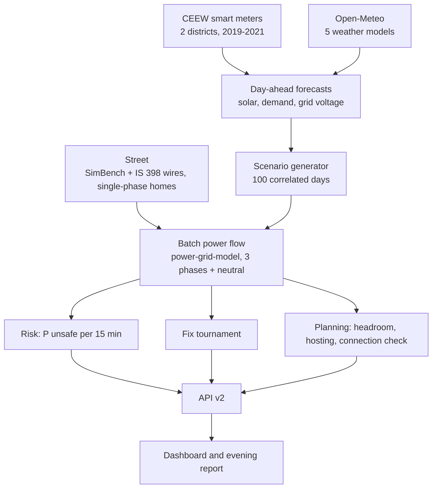

# GridTwin

[](https://github.com/abhay-hanchate/GridTwin/actions/workflows/ci.yml)
[](https://github.com/abhay-hanchate/GridTwin/actions/workflows/features.yml)

**HackMatrix 5.0 · Energy track · ENR-02 — Renewable Distribution Grid Digital Twin**

GridTwin is a day-ahead guard for low-voltage streets with rooftop solar. For tomorrow it gives the **chance of unsafe
voltage every 15 minutes**, **ranks the fixes that physics confirms are safe** (or says honestly that none is), and
tells a planner **how much more solar each part of the street and each phase can take**. Every number comes from a
power-flow run on real Indian smart-meter data and weather forecasts, and carries its provenance: observed, modeled or
benchmark.

This is **version 2**. What changed since Round 1, including what did not work, is in [CHANGELOG.md](CHANGELOG.md).

## The problem, in real data

India is putting rooftop solar on 1 crore homes (PM Surya Ghar). At midday the surplus flows back up the street's
wire and **raises** the voltage, which damages appliances and trips solar inverters. Smart meters in 38 Mathura homes
(CEEW, 2019; observed) show streets already at the edge:

| Measured at real homes | Value |
| --- | --- |
| Typical voltage (should be 230 V) | **245.5 V** |
| Time above 253 V (+10%) | **27.2%** |
| Time above 244 V (+6%, the UP Supply Code limit) | 54.9% |
| Time below 207 V (−10%) | 6.1% |

## What v2 finds

On the benchmark street (99 homes on single phases, one 250 kVA transformer) for the sunny demo day, 15 May 2025.
All values are modeled, from the precomputed results in `data/results/v2`:

| | ±10% of 230 V | UP Supply Code, ±6% |
| --- | --- | --- |
| Tomorrow's level | ACT from 06:15 | ACT from 00:00 |
| Expected unsafe hours (P10 to P90) | 9 (7 to 11.8) | 17.5 (15 to 20.3) |
| Fix tournament | **Recommended: tap +1 with IEEE 1547 Volt/VAR** | **No safe action.** Closest: tap +2 with Volt/VAR, 25 unsafe quarter hours left; the evening voltage falls to 208 V against the 216 V limit |
| Hosting capacity, share of homes (P10 to P90) | 20% to 50%; with Volt/VAR 80% to 100% | 0%; with Volt/VAR 0% to 11% |
| Extra solar a new home can add at the far end (no harm), by phase | 4.2 to 7 kW | 0 to 1.4 kW |

The UP rule squeezes from both sides: lowering the voltage enough for midday pushes evenings below 216 V, so no
setting tried is safe all day. The place **and the phase** of a new connection matter as much as its size, which a
flat state cap cannot see. On the cloudy demo day (5 August) the ±10% level is OK.

## How much to trust it

Every gate is measured by `python -m scripts.evaluate` into [data/results/results.json](data/results/results.json); the
dashboard's Proof page shows them, failed ones included.

| Gate | What | Result |
| --- | --- | --- |
| G1 | Engine matches pandapower (0.001 V apart) and is 647 times faster | pass |
| G2 | At least three weather models available (five used) | pass |
| G3 | Solar forecast error 0.0329 against Round 1's 0.0396 | pass |
| G4 | Demand v2: 8.4% skill, needed 10% | **fail** (Round 1's demand model stays) |
| G5 | Phase-aware engine converges; peak 268.4 to 272.6 V across zero-sequence assumptions | pass |
| G6 | Licences: Open-Meteo's free API is non-commercial only | conditional |
| G7 | Solar yield checked against a measured plant | not run (data needs an IEEE DataPort login) |
| G8 | Risk probabilities reliable on every rule: ±10% slightly better than the historical average; ±6% not | **fail** |

## The dashboard

Five areas, in English and Hindi, usable on a phone:

1. **Home** — tomorrow's risk strip, the one-line answer, expected unsafe hours, the peak voltage against the rule, a
   rule and demo-day selector, and a printable evening report.
2. **Try a change** — any mix of changes (panel size, grid voltage, EV charging, heatwave) and fixes, run through the
   engine; the form is generated from the API's catalogue.
3. **Fixes** — the ranked tournament with costs, phase moves and per-home export limits, or the honest "No safe
   action" with the limit that stops it and what it would still need.
4. **Planning** — headroom per phase and place beside the flat state caps, hosting capacity, and a connection check
   that approves, approves with conditions or refuses.
5. **Proof** — every gate, every method bake-off, and what was deliberately not built.

## How it works



| Part | Where | Notes |
| --- | --- | --- |
| Data and quality checks | `scripts/build_data.py`, `engine/profiles.py` | All six CEEW files; outages and surges treated as missing |
| Solar forecast v2 | `ml/solar_v2.py`, `ml/live_solar_v2.py` | LightGBM on five weather models, per-season conformal ranges |
| Demand and voltage for tomorrow | `ml/live_dayahead.py` | Anchored to live UP state demand when recorded, past patterns otherwise |
| Grid-side voltage | `engine/upstream.py` | Whole-day paths, chosen by a pre-registered bake-off |
| Scenarios | `engine/scenario_gen.py` | Gaussian copula couples sun, demand and grid voltage |
| Engine | `engine/solver.py`, `engine/network.py` | Phase-aware batch solver, IEEE 1547 inverters, pandapower cross-check |
| Violations and verdict | `engine/violations.py`, `engine/verdict.py` | Voltage, loading, neutral, unbalance, solver failure; the binding limit |
| Risk | `engine/risk.py`, `scripts/calibrate_risk.py` | Watch at 20%, act at 50%; isotonic recalibration |
| Fixes | `engine/fixes/` | Tap, inverters, export limits, phase moves (CP-SAT), switching, battery |
| Planning | `engine/headroom.py`, `engine/hosting.py` | Per-phase headroom, probabilistic hosting capacity, connection check |
| API v2 | `backend/v2/` | Cached results or a background job; offline mode; error model, metrics |
| Dashboard | `frontend/src/` | React, lazy-loaded pages, English and Hindi |
| Operations | `scripts/nightly.py`, `scripts/monitor.py`, `.github/workflows/` | Evening precompute, drift monitor, CI |

Method choices were written down before each run, with the result kept even where it went against the plan:
[docs/DECISIONS.md](docs/DECISIONS.md). Model cards: [docs/model_cards/](docs/model_cards/).

## API v2

All under `/api/v2` (documentation at `/api/v2/docs`). Slow results answer `202 {"status": "running", "job_id"}`;
poll `/jobs/{id}`. Errors are always `{"error": {"code", "message", "details"}}`.

| Route | Returns |
| --- | --- |
| `GET /risk` | Chance of an unsafe step per 15 minutes, expected unsafe hours, level, calibration |
| `GET /fixes` | The tournament: ranked safe fixes, or the no-safe-action verdict with the binding limit |
| `GET /simulate` | The design day without and with one fix |
| `GET /headroom`, `GET /hosting`, `POST /connection-check` | Planning |
| `GET /catalog`, `POST /whatif` | Every change and fix with its parameter schema; run any combination |
| `GET /rules`, `GET /networks` | Voltage rules with source and verification; street archetypes |
| `GET /results` | Every gate (`results.json`) |
| `GET /report?lang=en\|hi` | The printable evening report |
| `GET /health`, `GET /readiness`, `GET /metrics` | Operations |

The Round 1 API (`/api/...`) still runs beside it until the legacy path is removed.

## Run it

Requires Python 3.12 or 3.13 and Node.js 20.19+ or 22.12+.

**With Docker (the demo):**

```bash
docker compose up --build                       # http://localhost:8000, offline: serves the precomputed demo
GRIDTWIN_OFFLINE=0 docker compose up --build    # also computes requests that were not precomputed (can take minutes)
```

**From source:**

```bash
python -m venv .venv
source .venv/bin/activate            # Windows PowerShell: .\.venv\Scripts\Activate.ps1
python -m pip install -r requirements.txt -c constraints.txt
cd frontend && npm ci && VITE_DASHBOARD=v2 npm run build && cd ..   # without VITE_DASHBOARD=v2: the Round 1 dashboard
uvicorn backend.main:app             # http://127.0.0.1:8000; set GRIDTWIN_OFFLINE=1 to serve only precomputed results
```

`/api/v2/readiness` answers 200 only when the data the mode needs is present; offline it also checks that the
precomputed results match the code. After any engine change, run `python -m scripts.nightly` and commit
`data/results/v2` (see [docs/runbooks/](docs/runbooks/)).

**Rebuild from raw data** (about 1 GB download):

```bash
python scripts/download_data.py      # CEEW meters, Open-Meteo weather and forecasts into data/raw (not committed)
python scripts/build_data.py         # per-district 15-minute profiles and the quality report
python -m ml.solar_v2                # solar v2 and gates G2, G3
python -m ml.live_dayahead           # tomorrow's demand and voltage models
python -m scripts.nightly            # precompute the demo results
python -m scripts.evaluate           # every gate into data/results/results.json
python -m scripts.demo_script        # docs/DEMO_SCRIPT.md from the saved results
```

For frontend development, run `npm run dev` in `frontend/` alongside `uvicorn backend.main:app --reload`.

## Limits

- **No real-life check.** No public live household meters exist, so tomorrow's forecasts cannot be scored day by day;
  the drift monitor checks solar against ERA5 instead.
- **The street is a benchmark** (SimBench with Indian conductors), not a surveyed feeder, and which phase each home is
  on is assumed. A utility's own feeder and phase data replace both ([docs/ONBOARDING.md](docs/ONBOARDING.md)).
- **Short test windows:** the Mathura 2021 file ends on 20 February 2021, so the demand and risk hold-outs cover only
  winter days.
- **Live demand and voltage run on past patterns** until the UP state-demand recorder runs daily.
- **Weather licence:** a utility deployment needs a paid or other licensed weather source (gate G6).
- All assumptions, with their status: [docs/assumptions.md](docs/assumptions.md). What was deliberately not built is on
  the Proof page.

## Quality

- **Tests:** about 380 Python tests (engine, API, models, honesty and security) and 72 dashboard tests; `python
  scripts/check.py` runs lint, tests and the dashboard build like CI.
- **Honesty rules:** every number on screen comes from `results.json` or an API response; dashboard strings carry
  numbers only through placeholders; failed gates are shown.
- **Accessibility:** Lighthouse 100 on all five pages; about 81 KB of JavaScript on first load.
- **CI:** Python 3.12 and 3.13, the dashboard build and tests, dependency audit; nightly parity and performance tests
  and the evening precompute.
- **Demo:** [five-minute demo script](docs/DEMO_SCRIPT.md), generated from the saved results.

## Features

<!-- FEATURES:START -->
**24 of 28 features done.** Updated automatically when a pull request is merged; source: [features.csv](features.csv).

| ID | Feature | Area | Owner | Status | Pull request |
| --- | --- | --- | --- | --- | --- |
| F01 | Project scaffold: README and requirements | Repo | P1 | ✅ Done |  |
| F02 | Data pipeline: real CEEW demand and voltage and pvlib solar profiles | Data | P1 | ✅ Done | [#1](https://github.com/abhay-hanchate/GridTwin/pull/1) |
| F03 | Grid engine: street model and full-day power flow and scenarios | Engine | P1 | ✅ Done | [#2](https://github.com/abhay-hanchate/GridTwin/pull/2) |
| F04 | Seven corrective actions and all-day ranking with honest no-safe-action | Engine | P1 | ✅ Done | [#3](https://github.com/abhay-hanchate/GridTwin/pull/3) |
| F05 | Solar and demand forecasts with calibrated ranges and early warning | ML | P2 | ✅ Done | [#4](https://github.com/abhay-hanchate/GridTwin/pull/4) |
| F06 | FastAPI service with precomputed results | API | P2 | ✅ Done | [#5](https://github.com/abhay-hanchate/GridTwin/pull/5) |
| F07 | Dashboard: feeder map and fixes and forecast screens | Frontend | P4 | ✅ Done | [#6](https://github.com/abhay-hanchate/GridTwin/pull/6) |
| F08 | Docs and CI: README and assumptions and GitHub Actions | Quality | P3 | ✅ Done | [#7](https://github.com/abhay-hanchate/GridTwin/pull/7) |
| F09 | Plain-language story view and simpler wording | Frontend | P4 | ✅ Done | [#8](https://github.com/abhay-hanchate/GridTwin/pull/8) |
| F10 | Fix simulator and prediction-vs-reality simulator | Engine + Frontend | P4 | ✅ Done | [#9](https://github.com/abhay-hanchate/GridTwin/pull/9) |
| F11 | Automatic feature tracker (this file and the README table) | Quality | P1 | ✅ Done | [#10](https://github.com/abhay-hanchate/GridTwin/pull/10) |
| F12 | Solar model feature-importance report | ML | P2 | ✅ Done |  |
| F13 | Cloudy-day early warning and docs/ml.md | ML | P2 | ✅ Done |  |
| F14 | README setup fixes from a fresh-clone test | Quality | P3 | ✅ Done | [#11](https://github.com/abhay-hanchate/GridTwin/pull/11) |
| F15 | Test plan and bug issues | Quality | P3 | ✅ Done | [#11](https://github.com/abhay-hanchate/GridTwin/pull/11) |
| F16 | Edge-case tests | Quality | P3 | ✅ Done | [#11](https://github.com/abhay-hanchate/GridTwin/pull/11) |
| F17 | Demo script for the video | Docs | P3 | ✅ Done | [#11](https://github.com/abhay-hanchate/GridTwin/pull/11) |
| F18 | Hosting capacity: how much solar the street can take | Engine + Frontend | P3 | ✅ Done | [#11](https://github.com/abhay-hanchate/GridTwin/pull/11) |
| F19 | Faster dashboard: load each tab only when opened | Frontend | P4 | ✅ Done | [#13](https://github.com/abhay-hanchate/GridTwin/pull/13) |
| F20 | Phone layout and accessibility | Frontend | P4 | ✅ Done | [#14](https://github.com/abhay-hanchate/GridTwin/pull/14) |
| F21 | Live deployment with a public link | DevOps | P4 | ⏳ Planned |  |
| F22 | Feeder reconfiguration (switching) as a fix | Engine | Team | 🏁 Finale |  |
| F23 | Machine-learning shortcut model of the power flow | ML | Team | 🏁 Finale |  |
| F24 | AI assistant that explains each recommendation | ML | Team | 🏁 Finale |  |
| F25 | Final project document and PDF for the PPT and video | Docs | P4 | ✅ Done | [#15](https://github.com/abhay-hanchate/GridTwin/pull/15) |
| F26 | Live warning: separate solar-caused risk from the grid's own voltage |  | Tabsirshaikh | ✅ Done | [#17](https://github.com/abhay-hanchate/GridTwin/pull/17) |
| F27 | Docs: hosting capacity is built  not roadmap |  | abhay-hanchate | ✅ Done | [#18](https://github.com/abhay-hanchate/GridTwin/pull/18) |
| F28 | GridTwin v2.0.0: tomorrow's risk  verified fixes  planning and proof |  | Tabsirshaikh | ✅ Done | [#26](https://github.com/abhay-hanchate/GridTwin/pull/26) |
<!-- FEATURES:END -->

## Team

| Person | Role | Owns |
| --- | --- | --- |
| Person 1 (team leader) | Engine and data lead | Data pipeline, street model, power flow, fixes and ranking; repository and submission |
| Person 2 | ML and API | Solar and demand forecasts, early warning, FastAPI service |
| Person 3 | QA, testing, docs and pitch | Test plan, edge-case tests, device checks, README, PPT, video |
| Person 4 | Tech lead, new features | Dashboard, simulators, hosting capacity, performance, deployment |

## Data sources

| Data | Source | Licence / access |
| --- | --- | --- |
| Household use and voltage | [CEEW smart meter data, Mathura and Bareilly](https://dataverse.harvard.edu/dataset.xhtml?persistentId=doi:10.7910/DVN/GOCHJH) | CC0 |
| Weather, reanalysis, day-ahead forecasts | [Open-Meteo](https://open-meteo.com/) | CC BY 4.0 data; free API is non-commercial only |
| Street layout | [SimBench](https://github.com/e2nIEE/simbench) | Database ODbL 1.0, code BSD-3-Clause |
| Overhead conductor | ACSR Rabbit, IS 398 | Indian standard |
| Voltage tolerance | [CEA minutes on declared supply voltage](https://cea.nic.in/wp-content/uploads/dp_r/2022/06/Approved_MoM_of_the_Meeting_to_finalize_Declared_Supply_Voltage.pdf) | Public |
| Rooftop-solar policy | [PM Surya Ghar (PIB)](https://www.pib.gov.in/PressReleasePage.aspx?PRID=2010130) | Public |

Every assumption and limitation — what is observed, modeled or benchmark — is listed in [docs/assumptions.md](docs/assumptions.md).

**Licence note (gate G6):** Open-Meteo's free API is for non-commercial use. The demo and research use fit that; a utility deployment must use a paid Open-Meteo plan or another licensed weather source. The full register, including the SimBench ODbL terms for derived networks, is [docs/DATA_SOURCES.md](docs/DATA_SOURCES.md) and [NOTICE](NOTICE).

## Next

- A live deployment with a public link.
- Gate G7: calibrate solar yield against the measured Karnataka plant once the data is accessible.
- Record UP state demand daily so tomorrow's demand and voltage forecasts are anchored to it.
- Remove the Round 1 path and make the v2 dashboard the default build (after the `v2.0.0` tag).
