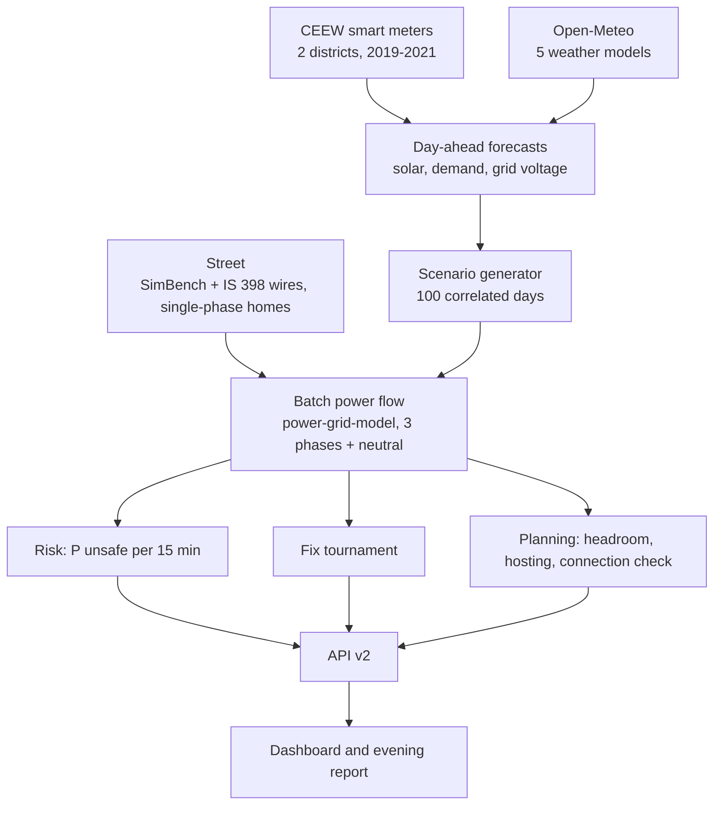

# GridTwin

[](https://github.com/abhay-hanchate/GridTwin/actions/workflows/ci.yml)
[](https://github.com/abhay-hanchate/GridTwin/actions/workflows/features.yml)

**HackMatrix 5.0 · Energy track · ENR-02 — Renewable Distribution Grid Digital Twin**

GridTwin is a day-ahead guard for low-voltage streets with rooftop solar. For tomorrow it gives the **chance of unsafe
voltage every 15 minutes**, **ranks the fixes that physics confirms are safe** (or says honestly that none is), and
tells a planner **how much more solar each part of the street and each phase can take**. Every number comes from a
power-flow run on real Indian smart-meter data and weather forecasts, and carries its provenance: observed, modeled or
benchmark. What changed in each release, including what did not work, is in [CHANGELOG.md](CHANGELOG.md).

## The problem, in real data

India is putting rooftop solar on 1 crore homes (PM Surya Ghar). At midday the surplus flows back up the street's
wire and **raises** the voltage, which damages appliances and trips solar inverters. Smart meters in 38 Mathura homes
(CEEW, 2019; observed) show streets already at the edge:

| Measured at real homes | Value |
| --- | --- |
| Typical voltage (should be 230 V) | **245.5 V** |
| Time above 253 V (+10%) | **27.2%** |
| Time above 244 V (+6%, the UP Supply Code limit) | 54.9% |
| Time below 207 V (−10%) | 6.1% |

## What v2 finds

On the benchmark street (99 homes on single phases, one 250 kVA transformer) for the sunny demo day, 15 May 2025.
All values are modeled, from the precomputed results in `data/results/v2` (regenerated 10 Oct 2026 on the corrected
grid-voltage history):

| | ±10% of 230 V | UP Supply Code, ±6% |
| --- | --- | --- |
| Tomorrow's level | ACT from 08:00 | ACT from 00:00 |
| Expected unsafe hours (recalibrated chances) | 7.6 | 16.3 |
| Fix tournament | **No safe action.** Closest: IEEE 1547 Volt/VAR, 4 unsafe quarter hours left at 254 V against the 253 V limit | **No safe action.** Closest: tap +1, Volt/VAR and per-house export limits, 28 unsafe quarter hours left at 248.4 V against 243.8 V |
| Hosting capacity, share of homes (P10 to P90) | 0% to 20%; with Volt/VAR 76% to 100% | 0%; with Volt/VAR 0% to 10% |
| Extra solar a new home can add at the far end (no harm), by phase | 1.4 to 8 kW | 0 to 5.2 kW |

On this day no option tried keeps every quarter hour safe under either rule; the tool names the closest option and
what it still needs ("about 1 V less voltage at the worst moments" under ±10%). On the cloudy (5 August) and mixed
(19 November) demo days a safe fix exists under ±10% (tap +1 with Volt/VAR, tap +2 with Volt/VAR); under the UP rule
none does on any of the three days. The place **and the phase** of a new connection matter as much as its size, which
a flat state cap cannot see.

## How much to trust it

Every gate is measured by `python -m scripts.evaluate` into [data/results/results.json](data/results/results.json); the
dashboard's Proof page shows them, failed ones included.

| Gate | What | Result |
| --- | --- | --- |
| G1 | Engine matches pandapower (0.001 V apart) and is far faster (455.7 times in the latest run; the factor varies with machine load) | pass |
| G2 | At least three weather models available (five used) | pass |
| G3 | Solar forecast error 0.0329 against the first solar model's 0.0396 | pass |
| G4 | Demand v2: 9.0% skill on the Mathura 2021 winter days, needed 10% (coverage 78.8%, inside 78 to 82%); on the held-out district 15.3% and 79.8% | **fail** (no AI-improvement claim for demand) |
| G5 | Phase-aware engine converges; peak 268.4 to 272.6 V across zero-sequence assumptions | pass |
| G6 | Licences: Open-Meteo's free API is non-commercial only | conditional |
| G7 | Solar yield checked against a measured plant | not run (data needs an IEEE DataPort login) |
| G8 | Risk probabilities reliable on every rule, on 100 held-out days of both districts: recalibrated Brier skill ±10% +0.51, UP ±6% +0.45 (Mathura alone under ±6% is below the base rate) | pass |

## The dashboard

An overview and five steps, in English and Hindi, usable on a phone. Each step answers one question and ends by
explaining every label it used and pointing to the next step.

- **Overview** — what GridTwin does, and the street playing out a whole day: press ▶ and watch power flow along
  phases A, B and C and the neutral, homes change colour with their voltage, and solar flow back to the
  transformer at midday. Then the day in plain words with four numbers.
1. **Tomorrow** — will the voltage be safe? The chance of unsafe voltage every quarter hour, split into what rooftop
   solar adds and what is the grid's own voltage (still unsafe with every panel switched off), the expected unsafe
   hours, the street replaying that day, and a printable evening report.
2. **Fixes** — which fix keeps the street safe? Every fix tried, ranked, or an honest "no safe fix" with the limit
   that stops it. Clicking a fix explains what it is, how it helps, who does it and what it costs, and plays the day
   on the street with and without it.
3. **Planning** — can the street take more solar? Hosting capacity, room per phase on a map of the street, a
   connection check by clicking any point, where to put a smart meter first, which transformers need attention
   first, and whether smart inverters help on these wires.
4. **Try a change** — what happens if things change? Ready-made futures (electric cars, twice the solar, a hot
   summer, a high grid voltage) or any mix of changes and fixes with sliders, compared with today's street.
5. **Proof** — how far can you trust it? Every check grouped by the question it answers, failed ones included.

The day is the real tomorrow (from today's live weather forecast) or any day of 2025 from the calendar. Days the
evening run computed open instantly; a new day takes a few minutes the first time. Offline, only computed days are
offered.

## How it works



| Part | Where | Notes |
| --- | --- | --- |
| Data and quality checks | `scripts/build_data.py`, `engine/profiles.py` | All six CEEW files; outages and surges treated as missing |
| Solar forecast v2 | `ml/solar_v2.py`, `ml/live_solar_v2.py` | LightGBM on five weather models, per-season conformal ranges |
| Demand and voltage for tomorrow | `ml/live_dayahead.py` | Anchored to live UP state demand when recorded, past patterns otherwise |
| Grid-side voltage | `engine/upstream.py` | Whole-day paths, chosen by a pre-registered bake-off |
| Scenarios | `engine/scenario_gen.py` | Gaussian copula couples sun, demand and grid voltage |
| Engine | `engine/solver.py`, `engine/network.py` | Phase-aware batch solver, IEEE 1547 inverters, pandapower cross-check |
| Violations and verdict | `engine/violations.py`, `engine/verdict.py` | Voltage, loading, neutral, unbalance, solver failure; the binding limit |
| Risk | `engine/risk.py`, `scripts/calibrate_risk.py` | Watch at 20%, act at 50%; isotonic recalibration |
| Fixes | `engine/fixes/` | Tap, inverters, export limits, phase moves (CP-SAT), switching, battery |
| Planning | `engine/headroom.py`, `engine/hosting.py`, `engine/planning_extra.py` | Per-phase headroom, probabilistic hosting capacity, connection check, meter-first ranking, R/X map, transformer ranking |
| API v2 | `backend/v2/` | Cached results or a background job; offline mode; error model, metrics |
| Dashboard | `frontend/src/` | React, lazy-loaded pages, English and Hindi |
| Operations | `scripts/nightly.py`, `scripts/monitor.py`, `.github/workflows/` | Evening precompute, drift monitor, CI |

Method choices were written down before each run, with the result kept even where it went against the plan:
[docs/DECISIONS.md](docs/DECISIONS.md). Model cards: [docs/model_cards/](docs/model_cards/).

## API v2

All under `/api/v2` (documentation at `/api/v2/docs`). Slow results answer `202 {"status": "running", "job_id"}`;
poll `/jobs/{id}`. Errors are always `{"error": {"code", "message", "details"}}`.

| Route | Returns |
| --- | --- |
| `GET /risk` | Chance of an unsafe step per 15 minutes (and the same with every panel off), expected unsafe hours, level, calibration |
| `GET /fixes` | The tournament: ranked safe fixes, or the no-safe-action verdict with the binding limit |
| `GET /simulate` | The design day without and with one fix |
| `GET /street` | The street as a schematic and the design day quarter hour by quarter hour: each home's voltage on its phase, per-phase power and neutral current on every wire, without and with any fix |
| `GET /calendar` | The days that can be shown: tomorrow, the forecast archive, and the days already computed |
| `GET /headroom`, `GET /hosting`, `POST /connection-check` | Planning |
| `GET /meter-sites`, `GET /rx-map`, `GET /transformers` | Where to meter first, Volt/VAR sensitivity to the wires, transformers by share of safe room used |
| `GET /catalog`, `POST /whatif` | Every change and fix with its parameter schema; run any combination against today's street |
| `GET /rules`, `GET /networks` | Voltage rules with source and verification; street archetypes |
| `GET /results` | Every gate (`results.json`) |
| `GET /report?lang=en\|hi` | The printable evening report |
| `GET /health`, `GET /readiness`, `GET /metrics` | Operations |

## Run it

Requires Python 3.12 or 3.13 and Node.js 20.19+ or 22.12+.

**With Docker (the demo):**

```bash
docker compose up --build                       # http://localhost:8000, offline: serves the precomputed demo
GRIDTWIN_OFFLINE=0 docker compose up --build    # also computes requests that were not precomputed (can take minutes)
```

**From source:**

```bash
python -m venv .venv
source .venv/bin/activate            # Windows PowerShell: .\.venv\Scripts\Activate.ps1
python -m pip install -r requirements.txt -c constraints.txt
cd frontend && npm ci && npm run build && cd ..
uvicorn backend.main:app             # http://127.0.0.1:8000; set GRIDTWIN_OFFLINE=1 to serve only precomputed results
```

`/api/v2/readiness` answers 200 only when the data the mode needs is present; offline it also checks that the
precomputed results match the code. After any engine change, run `python -m scripts.nightly` and commit
`data/results/v2` (see [docs/runbooks/](docs/runbooks/)).

**Rebuild from raw data** (about 1 GB download):

```bash
python scripts/download_data.py      # CEEW meters, Open-Meteo weather and forecasts into data/raw (not committed)
python scripts/build_data.py         # per-district 15-minute profiles and the quality report
python -m ml.solar_v2                # solar v2 and gates G2, G3
python -m ml.live_dayahead           # tomorrow's demand and voltage models
python -m scripts.nightly            # precompute the demo results
python -m scripts.evaluate           # every gate into data/results/results.json
python -m scripts.demo_script        # docs/DEMO_SCRIPT.md from the saved results
```

For frontend development, run `npm run dev` in `frontend/` alongside `uvicorn backend.main:app --reload`.

## Limits

- **No real-life check.** No public live household meters exist, so tomorrow's forecasts cannot be scored day by day;
  the drift monitor checks solar against ERA5 instead.
- **The street is a benchmark** (SimBench with Indian conductors), not a surveyed feeder, and which phase each home is
  on is assumed. A utility's own feeder and phase data replace both ([docs/ONBOARDING.md](docs/ONBOARDING.md)).
- **Short test windows:** the Mathura 2021 file ends on 20 February 2021, so the demand and risk hold-outs cover only
  winter days.
- **Live demand and voltage run on past patterns.** The evening workflow now records UP state demand, but the
  anchor uses the day before the forecast day, which for tomorrow is today and is complete only after midnight; on
  past data the anchor improved the voltage forecast by 0.07 V and the demand forecast not at all.
- **Weather licence:** a utility deployment needs a paid or other licensed weather source (gate G6).
- All assumptions, with their status: [docs/assumptions.md](docs/assumptions.md). What was deliberately not built is on
  the Proof page.

## Quality

- **Tests:** 381 Python tests (engine, API, models, honesty and security) and 116 dashboard tests; `python
  scripts/check.py` runs lint, tests and the dashboard build like CI.
- **Honesty rules:** every number on screen comes from `results.json` or an API response; dashboard strings carry
  numbers only through placeholders; failed gates are shown.
- **Accessibility:** the previous design scored Lighthouse 100; the redesigned six pages have not been re-measured. About 100 KB of JavaScript (gzipped) on first load.
- **CI:** Python 3.12 and 3.13, the dashboard build and tests, dependency audit; nightly parity and performance tests
  and the evening precompute.
- **Demo:** [five-minute demo script](docs/DEMO_SCRIPT.md), generated from the saved results.

## Features

<!-- FEATURES:START -->
**23 of 28 features done.** Updated automatically when a pull request is merged; source: [features.csv](features.csv).

| ID | Feature | Area | Owner | Status | Pull request |
| --- | --- | --- | --- | --- | --- |
| F01 | Data: all six CEEW meter files from two districts with outage and surge checks | Data | Team | ✅ Done | [#26](https://github.com/abhay-hanchate/GridTwin/pull/26) |
| F02 | Grid-side voltage for tomorrow: whole-day paths chosen by a bake-off | Data | Team | ✅ Done | [#26](https://github.com/abhay-hanchate/GridTwin/pull/26) |
| F03 | Five Indian street types with IS 398 conductors | Engine | Team | ✅ Done | [#26](https://github.com/abhay-hanchate/GridTwin/pull/26) |
| F04 | Phase-aware batch power flow with a pandapower cross-check | Engine | Team | ✅ Done | [#26](https://github.com/abhay-hanchate/GridTwin/pull/26) |
| F05 | Voltage-rule library with sources and verification status | Engine | Team | ✅ Done | [#26](https://github.com/abhay-hanchate/GridTwin/pull/26) |
| F06 | IEEE 1547 smart-inverter curves (Volt/VAR and Volt/Watt) | Engine | Team | ✅ Done | [#26](https://github.com/abhay-hanchate/GridTwin/pull/26) |
| F07 | Solar forecast v2 on five weather models with conformal ranges | ML | Team | ✅ Done | [#26](https://github.com/abhay-hanchate/GridTwin/pull/26) |
| F08 | Demand forecast v2 (gate G4 not met: no AI-improvement claim) | ML | Team | 🔄 In progress |  |
| F09 | Live day-ahead demand and grid voltage for tomorrow | ML | Team | ✅ Done | [#26](https://github.com/abhay-hanchate/GridTwin/pull/26) |
| F10 | Correlated scenarios of sun and demand and grid voltage | ML | Team | ✅ Done | [#26](https://github.com/abhay-hanchate/GridTwin/pull/26) |
| F11 | Risk: chance of unsafe voltage per 15 minutes and expected unsafe hours | Risk | Team | ✅ Done | [#26](https://github.com/abhay-hanchate/GridTwin/pull/26) |
| F12 | Fix tournament: tap and inverters and export limits and phase moves and switching and battery | Risk | Team | ✅ Done | [#26](https://github.com/abhay-hanchate/GridTwin/pull/26) |
| F13 | Honest no-safe-action verdict with the binding limit | Risk | Team | ✅ Done | [#26](https://github.com/abhay-hanchate/GridTwin/pull/26) |
| F14 | Planning: headroom per phase and probabilistic hosting capacity | Planning | Team | ✅ Done | [#26](https://github.com/abhay-hanchate/GridTwin/pull/26) |
| F15 | Connection check: approve or approve with conditions or refuse | Planning | Team | ✅ Done | [#26](https://github.com/abhay-hanchate/GridTwin/pull/26) |
| F16 | Planning: where to meter first and Volt/VAR sensitivity and transformer ranking | Planning | Team | 🔄 In progress |  |
| F17 | What-if catalogue: any mix of changes and fixes | API | Team | ✅ Done | [#26](https://github.com/abhay-hanchate/GridTwin/pull/26) |
| F18 | API v2 with cached results and background jobs and offline mode | API | Team | ✅ Done | [#26](https://github.com/abhay-hanchate/GridTwin/pull/26) |
| F19 | Dashboard: five areas in English and Hindi on a phone | Frontend | Team | ✅ Done | [#26](https://github.com/abhay-hanchate/GridTwin/pull/26) |
| F20 | Evening report and explanations that keep every number | Frontend | Team | ✅ Done | [#26](https://github.com/abhay-hanchate/GridTwin/pull/26) |
| F21 | Utility onboarding: feeder and homes and meter CSV checks | Data | Team | ✅ Done | [#26](https://github.com/abhay-hanchate/GridTwin/pull/26) |
| F22 | Evaluation of every gate into results.json and the Proof page | Quality | Team | ✅ Done | [#26](https://github.com/abhay-hanchate/GridTwin/pull/26) |
| F23 | Operations: evening precompute and drift monitor and metrics and runbooks and Docker | Quality | Team | ✅ Done | [#26](https://github.com/abhay-hanchate/GridTwin/pull/26) |
| F24 | Risk reliability on both districts (gate G8) | Risk | Team | 🔄 In progress |  |
| F25 | Solar yield checked against a measured plant (gate G7: needs data access) | ML | Team | ⏳ Planned |  |
| F26 | Live deployment with a public link | DevOps | Team | ⏳ Planned |  |
| F27 | Keep labels explainer on Overview only |  | ieafraazzz | ✅ Done | [#28](https://github.com/abhay-hanchate/GridTwin/pull/28) |
| F28 | Fix brief 10 Oct 2026: F1-F10  results regenerated on the fixed code |  | Tabsirshaikh | ✅ Done | [#29](https://github.com/abhay-hanchate/GridTwin/pull/29) |
<!-- FEATURES:END -->

## Team

| Person | Role | Owns |
| --- | --- | --- |
| Person 1 (team leader) | Engine and data lead | Data pipeline, street model, power flow, fixes and ranking; repository and submission |
| Person 2 | ML and API | Solar and demand forecasts, early warning, FastAPI service |
| Person 3 | QA, testing, docs and pitch | Test plan, edge-case tests, device checks, README, PPT, video |
| Person 4 | Tech lead, new features | Dashboard, simulators, hosting capacity, performance, deployment |

## Data sources

| Data | Source | Licence / access |
| --- | --- | --- |
| Household use and voltage | [CEEW smart meter data, Mathura and Bareilly](https://dataverse.harvard.edu/dataset.xhtml?persistentId=doi:10.7910/DVN/GOCHJH) | CC0 |
| Weather, reanalysis, day-ahead forecasts | [Open-Meteo](https://open-meteo.com/) | CC BY 4.0 data; free API is non-commercial only |
| Street layout | [SimBench](https://github.com/e2nIEE/simbench) | Database ODbL 1.0, code BSD-3-Clause |
| Overhead conductor | ACSR Rabbit, IS 398 | Indian standard |
| Voltage tolerance | [CEA minutes on declared supply voltage](https://cea.nic.in/wp-content/uploads/dp_r/2022/06/Approved_MoM_of_the_Meeting_to_finalize_Declared_Supply_Voltage.pdf) | Public |
| Rooftop-solar policy | [PM Surya Ghar (PIB)](https://www.pib.gov.in/PressReleasePage.aspx?PRID=2010130) | Public |

Every assumption and limitation — what is observed, modeled or benchmark — is listed in [docs/assumptions.md](docs/assumptions.md).

**Licence note (gate G6):** Open-Meteo's free API is for non-commercial use. The demo and research use fit that; a utility deployment must use a paid Open-Meteo plan or another licensed weather source. The full register, including the SimBench ODbL terms for derived networks, is [docs/DATA_SOURCES.md](docs/DATA_SOURCES.md) and [NOTICE](NOTICE).

## Next

- A live deployment with a public link.
- Gate G7: calibrate solar yield against the measured Karnataka plant once the data is accessible.
- Record UP state demand daily so tomorrow's demand and voltage forecasts are anchored to it.
