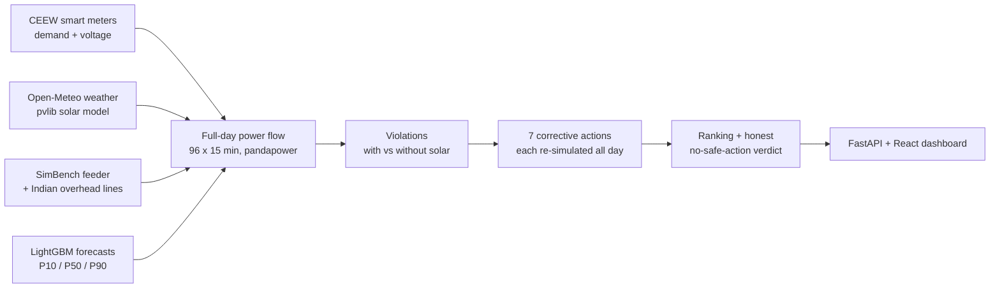

# GridTwin

[](https://github.com/abhay-hanchate/GridTwin/actions/workflows/ci.yml)

**HackMatrix 5.0 · ENR-02 — Renewable Distribution Grid Digital Twin**

GridTwin is a digital twin of a rural low-voltage feeder under growing rooftop solar. It runs on **real Indian household demand, real measured voltage and real weather**, predicts where and when voltage becomes unsafe, tests corrective actions over the whole day, and recommends the cheapest safe one — or says honestly that no safe action exists.

## The problem, in real data

Smart meters in 38 Mathura homes (CEEW, 2019) show that Indian feeders already run hot:

| Measured at real homes | Value |
| --- | --- |
| Median voltage (nominal 230 V) | **245.5 V** |
| Readings above the +10% limit (253 V) | **27.2%** |
| Readings below the −10% limit (207 V) | 6.1% |

PM Surya Ghar is adding rooftop solar to 1 crore homes. At midday, solar flows back up the wires and pushes voltage higher still.

## What GridTwin finds (15 May 2019, 99 homes, ±10% band)

| Scenario | Unsafe 15-min steps | Caused by solar | Peak |
| --- | --- | --- | --- |
| S1 · no rooftop solar | 5 | 0 | 256 V |
| S2 · 30% of homes with 3 kW | 12 | 7 | 256 V |
| S3 · 60% of homes | 16 | 11 | 259 V |
| S4 · every home | **26** | **21** | **263 V** |
| S5 · every home, strict ±6% band | 47 | 4 | 263 V |

**Recommended fix for S4:** transformer tap +1 together with inverter Volt/VAR (power factor 0.9) clears all 26 unsafe steps with **zero solar wasted**. No single action does it alone; curtailing solar to 60% wastes 489 kWh and still leaves 15 unsafe steps. Under the strict ±6% band, **no safe action exists**, and GridTwin says so.

**Early warning:** for 15 May 2025, the solar forecast predicted 27 unsafe steps (peak 1.157 pu) a day ahead; 28 happened (peak 1.158 pu).

## Screenshots

**Grid twin** — every connection point coloured by voltage at 11:00 with solar on every home; play through the day.


**Fixes** — every action re-simulated for all 96 steps and ranked; only fixes safe all day count.


**Forecast and early warning** — tomorrow's solar forecast run through the grid predicts unsafe voltage a day ahead.


## How it works



| Layer | What it does |
| --- | --- |
| `engine/profiles.py` | Real CEEW demand (15-min kW), median customer voltage, pvlib solar |
| `engine/grid.py` | SimBench rural feeder, Indian ACSR Rabbit overhead lines, working taps |
| `engine/powerflow.py` | 96-step AC power flow, over/under-voltage and overload detection |
| `engine/actions.py` | Tap, Volt/VAR, tap + Volt/VAR, export caps, volt-droop battery |
| `engine/ranking.py` | Safe all day or rejected; ranked by solar wasted, battery use, losses |
| `ml/forecast.py` | LightGBM quantile forecasts with calibrated uncertainty bands |
| `ml/early_warning.py` | Forecast solar through the grid to predict unsafe voltage a day ahead |
| `backend/main.py` | FastAPI serving precomputed results instantly |
| `frontend/` | React dashboard: feeder map, fixes, forecasts |

## AI / ML

| Model | Inputs | Test | Result |
| --- | --- | --- | --- |
| Solar, LightGBM quantile | Weather forecast issued the day before | 2025 | 13% better than same-hour-yesterday; 82% of outcomes inside the P10–P90 band |
| Demand, LightGBM quantile | Real household history, temperature | Nov–Dec 2019 | 5% better than same-time-yesterday; 82% band coverage |

Physics verifies every recommendation: the ML predicts the problem, the power flow checks every fix.

## Run it

Requires Python 3.11 and Node 20+.

```bash
python -m venv .venv && .venv/Scripts/activate      # Windows; use .venv/bin/activate on Linux/macOS
pip install -r requirements.txt

# Dashboard with the committed, precomputed results
cd frontend && npm install && npm run build && cd ..
uvicorn backend.main:app                            # open http://127.0.0.1:8000
```

Rebuild everything from raw data (about 10 minutes):

```bash
python scripts/download_data.py    # CEEW smart meters + Open-Meteo weather into data/raw (not committed)
python scripts/build_data.py       # 15-minute profiles into data/processed
python -m ml.forecast              # train forecasts, write ml/reports/metrics.json
python scripts/precompute.py       # scenarios, fixes and early warning into data/results
pytest -q tests
```

For frontend development, run `npm run dev` in `frontend/` alongside `uvicorn backend.main:app --reload`.

## Data sources

| Data | Source | Licence / access |
| --- | --- | --- |
| Household demand and voltage | [CEEW smart meter data, Mathura](https://dataverse.harvard.edu/dataset.xhtml?persistentId=doi:10.7910/DVN/GOCHJH) | CC0 |
| Weather, reanalysis, day-ahead forecasts | [Open-Meteo](https://open-meteo.com/) | Free, non-commercial |
| Feeder topology | [SimBench](https://github.com/e2nIEE/simbench) | Open benchmark |
| Overhead conductor | ACSR Rabbit, IS 398 | Indian standard |
| Voltage tolerance | [CEA minutes on declared supply voltage](https://cea.nic.in/wp-content/uploads/dp_r/2022/06/Approved_MoM_of_the_Meeting_to_finalize_Declared_Supply_Voltage.pdf) | Public |
| Rooftop-solar policy | [PM Surya Ghar (PIB)](https://www.pib.gov.in/PressReleasePage.aspx?PRID=2010130) | Public |

Every assumption and limitation is listed in [docs/assumptions.md](docs/assumptions.md).

## Roadmap (finale)

- Feeder reconfiguration through switching
- ML surrogate of the power flow to screen hundreds of actions in milliseconds
- LLM operator assistant that explains each recommendation from the evidence record
